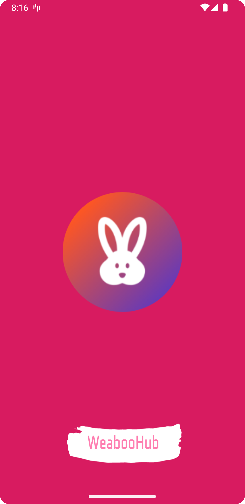
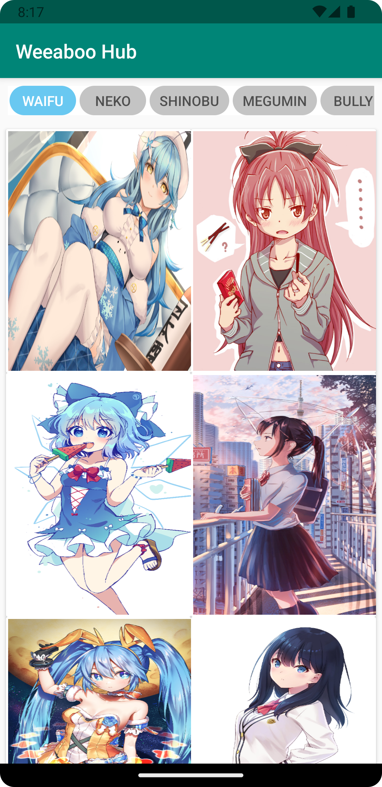
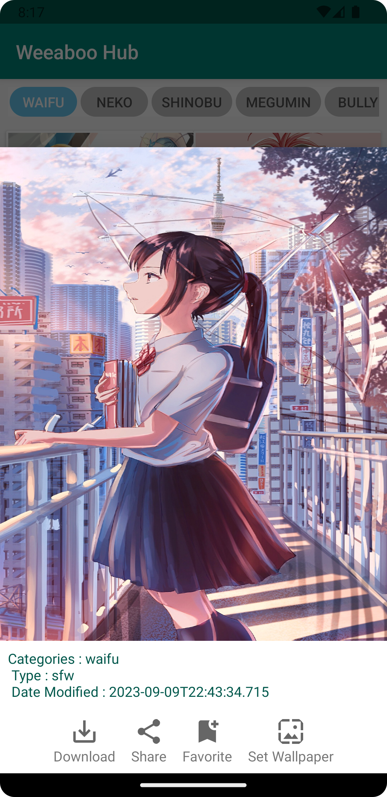

WeeabooHub
===========

[Download Here](https://play.google.com/store/apps/details?id=com.raytalktech.weeaboohub)

A Final Project
for [#JuaraAndroid - Android Study Jam 2022](https://rsvp.withgoogle.com/events/juara-android-22)
From Google.

Architecture
----------------

Library
--------

- Retrofit
- Coil
- Moshi
- Lifecycle
- Android X
- Material Design
- Navigation Fragment
- Data Binding

Getting Started
-------------------

- Install Latest Android Studio Version
- Clone this project
- Run using Android Studio

## How To Change The Splashscreen

### Change The Icon

Put your new Icon on the mipmap and rename with "ic_launcher". You can try icon.kitchen to make
yourself icon.
The file can be svg, xml, png or jpeg.

### Change The Branding Icon

Put your new Branding Icon on the drawable and rename with "ic_branding". The file can be svg, xml,
png, or jpeg

### Change The Color of themes

Go to the /res/values/splash_theme directory, and change the color as you need on splash_theme.xml.
There is more than 2 same file name,
to need you change. Make sure you has been customize all of them.

Credit
------
- [icon.kitchen](https://icon.kitchen)